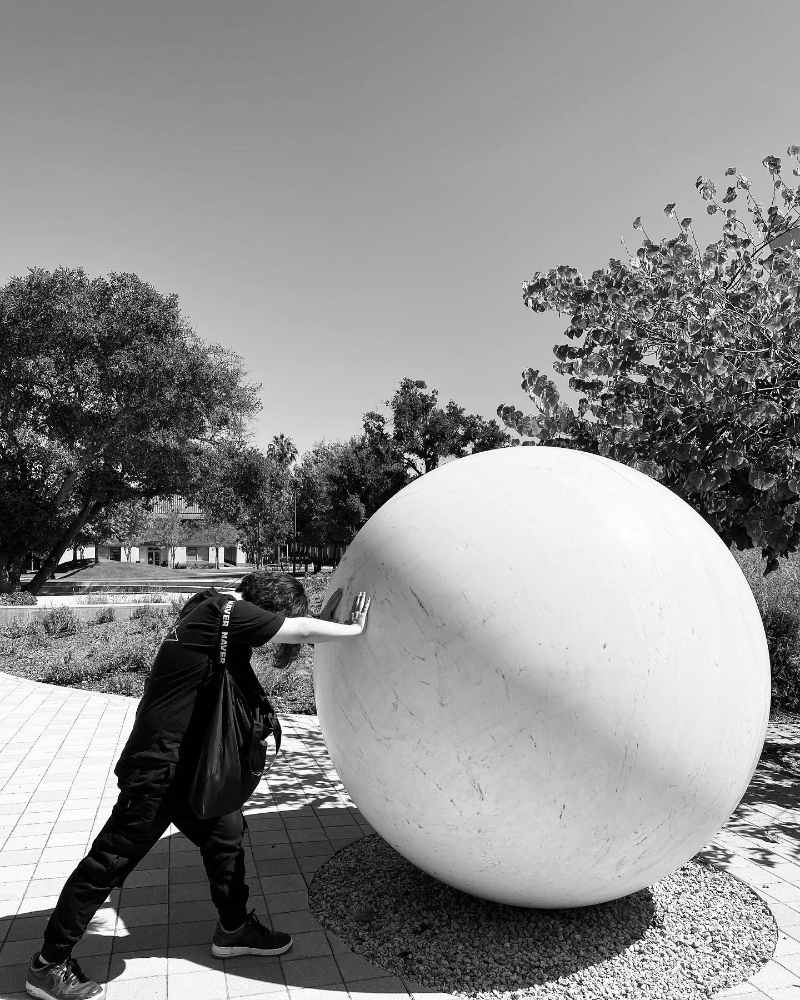

<figure>

</figure>

*I am on the job market for the 2025–2026 academic year.*

I am a fifth-year Ph.D. student in Mathematics at UC Berkeley, advised by [Sug Woo Shin](https://math.berkeley.edu/~swshin/).
My research interests lie in computational number theory and, more broadly, in computer-assisted mathematics. This includes areas such as optimization problems (e.g., various linear programming problems involving automorphic forms), formalization, and the application of machine learning to pure mathematics.
I was one of the contributors for the [FrontierMath Tier4 benchmark](https://epoch.ai/frontiermath/tier-4).
I am also interested in automorphic forms and representations, particularly in the context of the (relative) Langlands program and Ichino-Ikeda type conjectures.

Previously, I completed a master’s program at POSTECH, where I was advised by [YoungJu Choie](https://yjchoie.postech.ac.kr/).

---

Office: [See here](https://seewoo5.github.io/jekyll/update/2025/09/12/office-number.html)

---

Feel free to email me if you have any questions.

Email: seewoo5 + at + berkeley + dot + edu