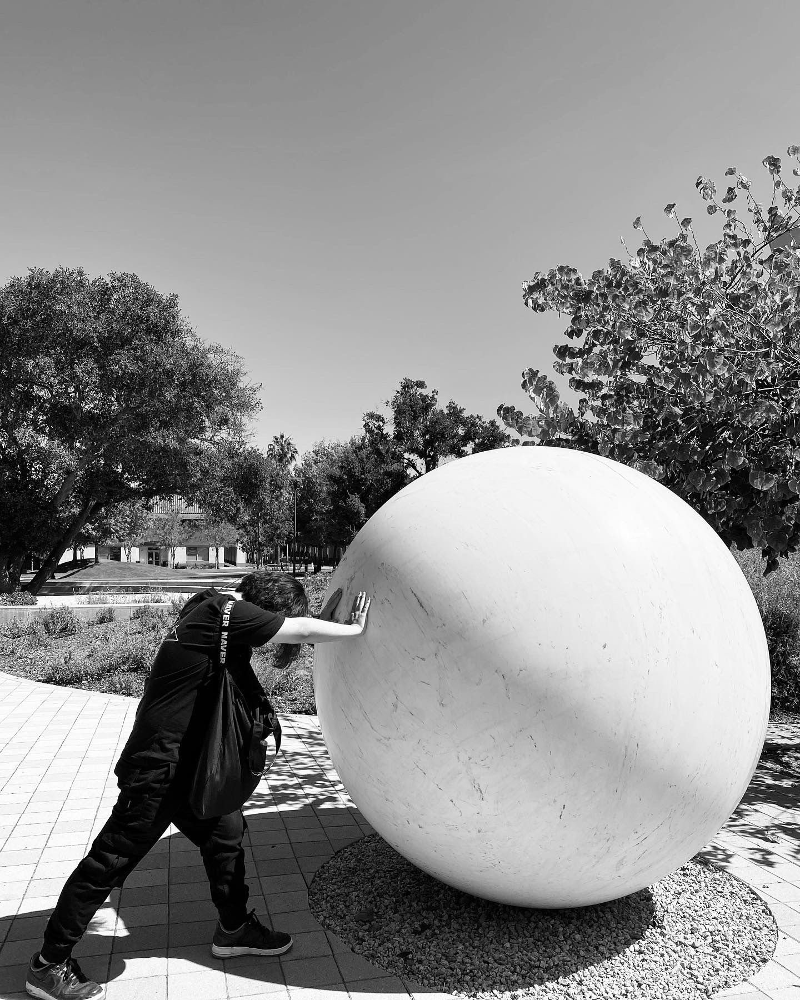

<figure>

</figure>

I am a fifth-year Ph.D. student in Mathematics at UC Berkeley, advised by [Sug Woo Shin](https://math.berkeley.edu/~swshin/).

My research interests lie in computational number theory and, more broadly, in computer-assisted mathematics. This includes areas such as optimization problems (e.g., various linear programming problems involving automorphic forms), formalization, and the application of machine learning to pure mathematics.
I am one of the maintainers for the [Sphere Packing in Lean project](https://github.com/thefundamentaltheor3m/Sphere-Packing-Lean), and also one of the contributors for the [FrontierMath Tier4 benchmark](https://epoch.ai/frontiermath/tier-4).
I am also interested in automorphic forms and representations, particularly in the context of the (relative) Langlands program and Ichino-Ikeda type conjectures.

During my alternative military service in South Korea from 2019 to 2022, I worked at [Riiid](https://corp.socra.ai/) and [CryptoLab](https://www.cryptolab.co.kr/en/home/) as AI Research Scientist and Engineer, respectively. I also worked at [Axiom](https://axiommath.ai/) as an intern in 2026 Spring.

I'll be at EPFL from August 2026.

Previously, I completed a master’s program at POSTECH, where I was advised by [YoungJu Choie](https://yjchoie.postech.ac.kr/).

---

Office: [See here](https://seewoo5.github.io/jekyll/update/2025/09/12/office-number.html)

---

See [travel](travel) to see where I visited, am visiting, and will visit.

---

Email: seewoo5 + at + berkeley + dot + edu