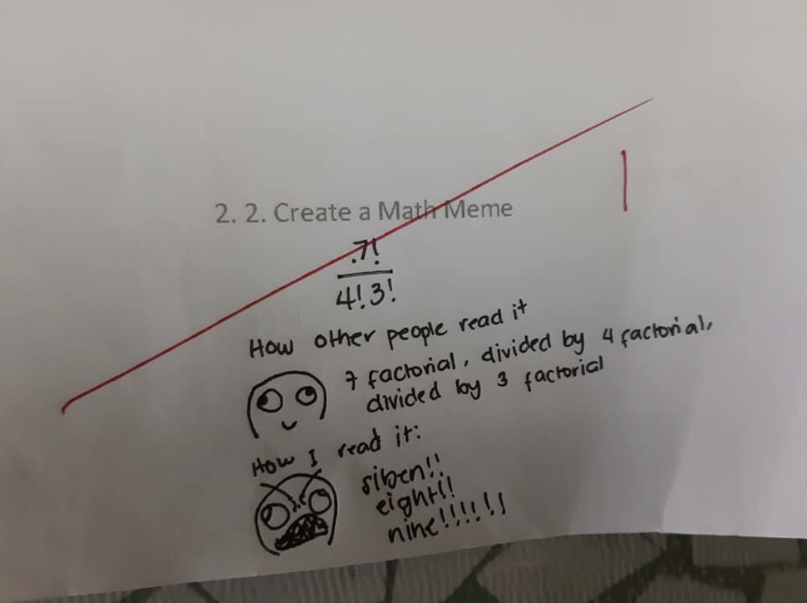

## Methods of Mathematics: Calculus, Statistics, and Combinatorics

Professor: Zvezdelina Stankova

Quiz and worksheet (with solutions and comments) will be uploaded here. Please go to bCourse for the other course materials. These things will be updated occasionally, so try to check whether it is the latest version or not. **PLEASE let me know if there are any errors in solutions of worksheets or quizzes**. 

If you have any questions about the lecture, discussion section, quiz, hw, or anything about me, please come to my office hour. I'll also answer questions via mail, but it may take some time to reply. Also, please read [the course syllabus](StudentHandout10BS19.pdf) seriously. 

Office hour is **TTh 2pm-3pm, Evans 850**. Since I have a class that ends 2pm every TTh, it may start at 2:05 and end at 3:05. If you cannot make this time, then you can go other GSI's office hour since all of us have different office hours. However, if you have very specific question to ask me, we can make an appointment by email. 

### Worksheets

| | Tue | Tue (sol) | Thu | Thu (sol) |
| --- | :---: | :---: | :---: | :---: |
| Week1         |       |       | [190124](worksheets/WS_190124.pdf)    | [190124sol](worksheets/WS_190124_sol.pdf)     |
| Week2         | [190129](worksheets/WS_190129.pdf)    | [190129sol](worksheets/WS_190129_sol.pdf)     | [190131](worksheets/WS_190131.pdf)    | [190131sol](worksheets/WS_190131_sol.pdf)        |
| Week3         | [190205](worksheets/WS_190205.pdf)    | [190205sol](worksheets/WS_190205_sol.pdf)     | [190207](worksheets/WS_190207.pdf)    | [190207sol](worksheets/WS_190207_sol.pdf)        |
| Week4         | [190212](worksheets/WS_190212.pdf)    | [190212sol](worksheets/WS_190212_sol.pdf)     | [190214](worksheets/WS_190214.pdf)    | [190214sol](worksheets/WS_190214_sol.pdf)        |
| Week5         | [190219](worksheets/WS_190219.pdf)    | [190219sol](worksheets/WS_190219_sol.pdf)     | [190221](worksheets/WS_190221.pdf)    | [190221sol](worksheets/WS_190221_sol.pdf)        |
| Week6         | [190226](worksheets/WS_190226.pdf)    | [190226sol](worksheets/WS_190226_sol.pdf)     | [190228](worksheets/WS_190228.pdf)    | [190228sol](worksheets/WS_190228_sol.pdf)        |
| Week7         | [190305](worksheets/WS_190305.pdf)    | [190305sol](worksheets/WS_190305_sol.pdf)     | [190307](worksheets/WS_190307.pdf)    | [190307sol](worksheets/WS_190307_sol.pdf)        |
| Week8         | [190312](worksheets/WS_190312.pdf)    | [190312sol](worksheets/WS_190312_sol.pdf)     | [190314](worksheets/WS_190314.pdf)    | [190314sol](worksheets/WS_190314_sol.pdf)        |
| Week9         | [190319](worksheets/WS_190319.pdf)    | [190319sol](worksheets/WS_190319_sol.pdf)     | [190321](worksheets/WS_190321.pdf)    | [190321sol](worksheets/WS_190321_sol.pdf)        |
Week10  | 🏖 | SPRING | BREAK | 🏝 |
| Week11        | [190402](worksheets/WS_190402.pdf)    | [190402sol](worksheets/WS_190402_sol.pdf)     | [190404](worksheets/WS_190404.pdf)    | [190404sol](worksheets/WS_190404_sol.pdf)        |
| Week12        | [190409](worksheets/WS_190409.pdf)    | [190409sol](worksheets/WS_190409_sol.pdf)     | [190411](worksheets/WS_190411.pdf)    | [190411sol](worksheets/WS_190411_sol.pdf)        |
| Week13        | [190416](worksheets/WS_190416.pdf)    | [190416sol](worksheets/WS_190416_sol.pdf)     | [190418](worksheets/WS_190418.pdf)    | [190418sol](worksheets/WS_190418_sol.pdf)        |
| Week14        | [190423](worksheets/WS_190423.pdf)    | [190423sol](worksheets/WS_190423_sol.pdf)     | [190425](worksheets/WS_190425.pdf)    | [190425sol](worksheets/WS_190425_sol.pdf)        |
| Week15        | [190430](worksheets/WS_190430.pdf)    | [190430sol](worksheets/WS_190430_sol.pdf)     | [190502](worksheets/WS_190502.pdf)    | [190502sol](worksheets/WS_190502_sol.pdf)        |
| Week16        | [FinalReview1](worksheets/FinalReview1.pdf) | | [FinalReview2](worksheets/FinalReview2.pdf) | |

### Quizzes

| | Tue | Tue (sol) | Thu | Thu (sol) |
| --- | :---: | :---: | :---: | :---: |
| Week1         |       |       |       |       |
| Week2         | [Quiz1(1)](quizzes/Quiz1(1).pdf)      | [Quiz1(1)sol](quizzes/Quiz1(1)_sol.pdf)       | [Quiz1(2)](quizzes/Quiz1(2).pdf)      | [Quiz1(2)sol](quizzes/Quiz1(2)_sol.pdf)  |
| Week3         | [Quiz2(1)](quizzes/Quiz2(1).pdf)      | [Quiz2(1)sol](quizzes/Quiz2(1)_sol.pdf)       | [Quiz2(2)](quizzes/Quiz2(2).pdf)      | [Quiz2(2)sol](quizzes/Quiz2(2)_sol.pdf)  |
| Week4         | [Quiz3(1)](quizzes/Quiz3(1).pdf)      | [Quiz3(1)sol](quizzes/Quiz3(1)_sol.pdf)       | [Quiz3(2)](quizzes/Quiz3(2).pdf)      | [Quiz3(2)sol](quizzes/Quiz3(2)_sol.pdf)  |
| Week5         | [Quiz4(1)](quizzes/Quiz4(1).pdf)      | [Quiz4(1)sol](quizzes/Quiz4(1)_sol.pdf)       | [Quiz4(2)](quizzes/Quiz4(2).pdf)      | [Quiz4(2)sol](quizzes/Quiz4(2)_sol.pdf)  |
| Week6         | [Quiz5(1)](quizzes/Quiz5(1).pdf)      | [Quiz5(1)sol](quizzes/Quiz5(1)_sol.pdf)       | [Quiz5(2)](quizzes/Quiz5(2).pdf)      | [Quiz5(2)sol](quizzes/Quiz5(2)_sol.pdf)  |
| Week7         | [Quiz6(1)](quizzes/Quiz6(1).pdf)      | [Quiz6(1)sol](quizzes/Quiz6(1)_sol.pdf)       | [Quiz6(2)](quizzes/Quiz6(2).pdf)      | [Quiz6(2)sol](quizzes/Quiz6(2)_sol.pdf)  |
| Week8         | [Quiz7(1)](quizzes/Quiz7(1).pdf)      | [Quiz7(1)sol](quizzes/Quiz7(1)_sol.pdf)       | [Quiz7(2)](quizzes/Quiz7(2).pdf)      | [Quiz7(2)sol](quizzes/Quiz7(2)_sol.pdf)  |
| Week9         | [Quiz8(1)](quizzes/Quiz8(1).pdf)      | [Quiz8(1)sol](quizzes/Quiz8(1)_sol.pdf)       | [Quiz8(2)](quizzes/Quiz8(2).pdf)      | [Quiz8(2)sol](quizzes/Quiz8(2)_sol.pdf)  |
Week10  | 🏖 | SPRING | BREAK | 🏝 |
| Week11        | [Quiz9(1)](quizzes/Quiz9(1).pdf)      | [Quiz9(1)sol](quizzes/Quiz9(1)_sol.pdf)       | [Quiz9(2)](quizzes/Quiz9(2).pdf)      | [Quiz9(2)sol](quizzes/Quiz9(2)_sol.pdf)  |
| Week12        | [Quiz10(1)](quizzes/Quiz10(1).pdf)    | [Quiz10(1)sol](quizzes/Quiz10(1)_sol.pdf)     | [Quiz10(2)](quizzes/Quiz10(2).pdf)    | [Quiz10(2)sol](quizzes/Quiz10(2)_sol.pdf)        |
| Week13        | [Quiz11(1)](quizzes/Quiz11(1).pdf)    | [Quiz11(1)sol](quizzes/Quiz11(1)_sol.pdf)     | [Quiz11(2)](quizzes/Quiz11(2).pdf)    | [Quiz11(2)sol](quizzes/Quiz11(2)_sol.pdf)        |
| Week14        | [Quiz12(1)](quizzes/Quiz12(1).pdf)    | [Quiz12(1)sol](quizzes/Quiz12(1)_sol.pdf)     | [Quiz12(2)](quizzes/Quiz12(2).pdf)    | [Quiz12(2)sol](quizzes/Quiz12(2)_sol.pdf)        |
| Week15        | [Quiz13(1)](quizzes/Quiz13(1).pdf)    | [Quiz13(1)sol](quizzes/Quiz13(1)_sol.pdf)     | [Quiz13(2)](quizzes/Quiz13(2).pdf)    | [Quiz13(2)sol](quizzes/Quiz13(2)_sol.pdf)        |

### Others

[Probabilities in 5-cards poker](pokerprob.pdf)

