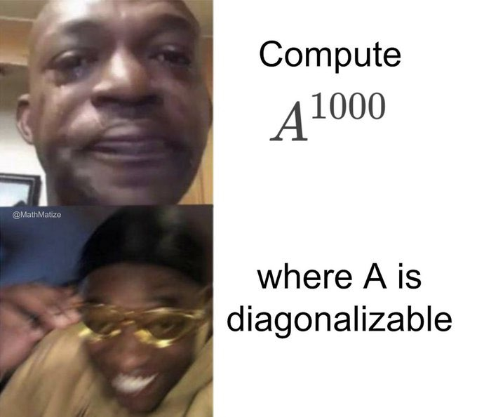

## Methods of Mathematics: Calculus, Statistics, and Combinatorics

Professor: [Norman Sheu](https://sites.google.com/view/normansheu/teaching/math-10a-fall-2023?authuser=1)

#### Discussion

* Section 101: Tue & Thu, 9:30 am - 11:00 am, Evans 70
* Section 103: Tue & Thu, 11:00 am - 12:30 pm, Wheeler 124

*We have Berkeley time - discussion will start 10 minutes later than stated above.*

#### Office hour

**Mon 2:00 pm - 3:00 pm, Thu 2:00 pm - 3:00 pm, Evans 1066**

You can go to any GSI's office hour if this conflicts with your schedules. Also, feel free to email me for any specific questions so that we can possibly have an extra meeting.

* Office hour on Sep 7 (Thursday) would be **1:00 pm - 2:00 pm** instead of **2:00 pm - 3:00 pm**.
* There will be no office hour on Oct 5 (Thursday). Instead, I'll have an office hour on Oct 2 (Monday) **2:00 pm - 4:00 pm**.

#### Homework

You need to submit homework **every Thursday**, at the end of the discussion. Also, you must submit only physical copy - **do not email me!**. Five problems wil be chosen at random to be graded for completion. Three of the lowest homework scores will be dropped. Working with others is encouraged, but you must write your solutions on your own and write the names of your collaborators at the top of the assignment.
Also, no homework for the first week.

#### Quizzes

**There are NO quizzes in this class!**

#### Attendance

Attendence will be checked at the end of every discussion. It is strongly encouraged to attend all the discussions. Also, attending all (two) discussions in a week would give **0.375%** extra credit, and a maximum of **3%** can be added in this way (so 8 weeks of full attendances will give you the maximum extra credit).

#### Q&A

Most of the questions are already answered in Norman Sheu's website above.
But in case you haven't find an answer to your question...

Q. Are there any good sources for practice other than our textbook?

A. For linear algebra parts, you can use

* Thomas, Multivatiable Calculus, Chapter 12
* Strang, Linear Algebra and Its Applications (just consider 2 by 2 and 3 by 3 matrices - it's a bit more than that)

For calculus, you can use

* Thomas, Calculus
* Any random thick calculus book looks like Stewart's and Thomas'

Q. Why $(AB)^{-1} = B^{-1}A^{-1}$?

A. Imagine $A$ is socks and $B$ is shoes.
You put on your socks first and then shoes ($=AB$).
To take off these ($=(AB)^{-1}$), you take of shoes first and then socks ($B^{-1} \cdot A^{-1}$).
Hence $(AB)^{-1} = B^{-1}A^{-1}$.

Q. Do you have any meme on geometric series?

A.

Q. Othere memes?

A. For diagonalization:

Q. Cool calculus song?

A. https://www.youtube.com/watch?v=uqwC41RDPyg

#### Worksheets

| | Tue | Thu |
| --- | :---: | :---: |
| Week1 | - | [230824](worksheets/WS230824.pdf) |
| Week2 | [230829](worksheets/WS230829sol.pdf) | [230831](worksheets/WS230831sol.pdf) |
| Week3 | [230905](worksheets/WS230905sol.pdf) | [230907](worksheets/WS230907sol.pdf)|
| Week4 | [230912](worksheets/WS230912sol.pdf) | [230914](worksheets/WS230914sol.pdf) |
| Week5 | [230919](worksheets/WS230919sol_fixed2.pdf) | [mid1 prep](worksheets/practice1sol_fixed.pdf) |
| Week6 | [230926](worksheets/WS230926sol2.pdf) | [230928](worksheets/WS230928sol.pdf) |
| Week7 | [231003](worksheets/WS231003sol.pdf) | [231005](worksheets/WS231005sol.pdf)|
| Week8 | [231010](worksheets/WS231010sol.pdf) | [231012](worksheets/WS231012sol.pdf) |
| Week9 | [231017](worksheets/WS231017sol.pdf) | [231019](worksheets/WS231019sol.pdf)|
| Week10 | [231024](worksheets/WS231024sol.pdf) | [231026](worksheets/WS231026sol.pdf) |
| Week11 | [231031](worksheets/WS231031sol.pdf) | [mid2 prep](worksheets/practice2sol2.pdf) |
| Week12 | [231107](worksheets/WS231107sol.pdf) | [231109](worksheets/WS231109sol.pdf)|
| Week13 | [231114](worksheets/WS231114sol.pdf) | [231116](worksheets/WS231116sol2.pdf) |
| Week14 | [231121](worksheets/WS231121sol.pdf) | [🍁](https://en.wikipedia.org/wiki/Thanksgiving) |
| Week15 | [231128](worksheets/WS231128sol2.pdf) | [231130](worksheets/WS231130sol.pdf) |

Let me know if you find any errors in the worksheets (and solutions).
These will be also uploaded on bCourses - Files.

#### Graded HW problems (ramdomly selected)

**HW1** \
8.1 #5 #15 #25 #29 #39

**HW2** \
8.2 #17 #35 \
8.3 #21 #31 \
8.4 #9

**HW3** \
8.5 #7 #19 \
8.6 #1 #13 #15

**HW4** \
8.6 #19 #25 \
8.7 #11 \
8.8 #5 #19

**HW5** \
1.1 #7 #29 #57 #67 #73

**HW6** \
1.2 #3 \
1.3 #33 \
1.4 #21 \
1.5 #49 \
2.1 #17

**HW7** \
2.2 #27 \
2.4 #13 \
3.1 #9 \
3.2 #29 \
3.3 #37

**HW8** \
3.4 #27 \
3.5 #43 #71 \
3.7 #47 \
3.8 #35

**HW9** \
4.1 #29 \
4.2 #17 #43 \
4.3 #5 #37

**HW10** \
4.4 #17 \
4.6 #39 \
5.1 #15 \
5.2 #33 \
5.3 #41

**HW11**

5.3 #73 \
5.4 #17 #51 \
5.5 #19 #23

**HW12**

5.6 #3 #7 #13 #17 #21

#### Extra notes

* [Why matrix multiplication is weird](matmul.pdf)
* [Taylor approximation is not a universal problem solver](analytic_functions.pdf)